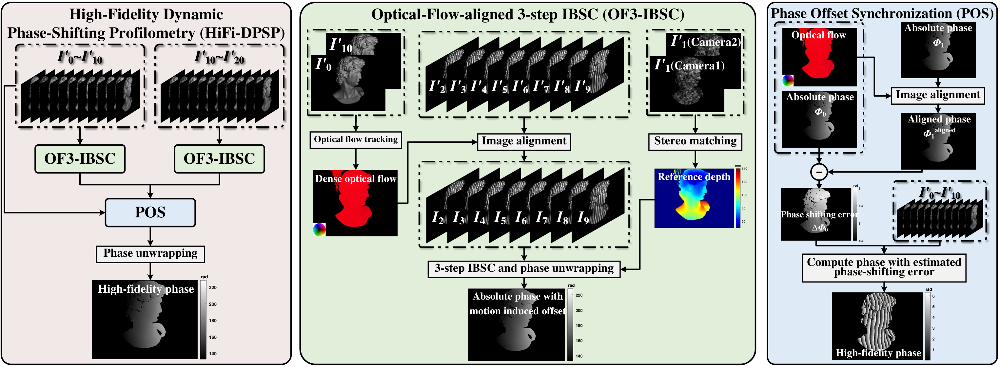
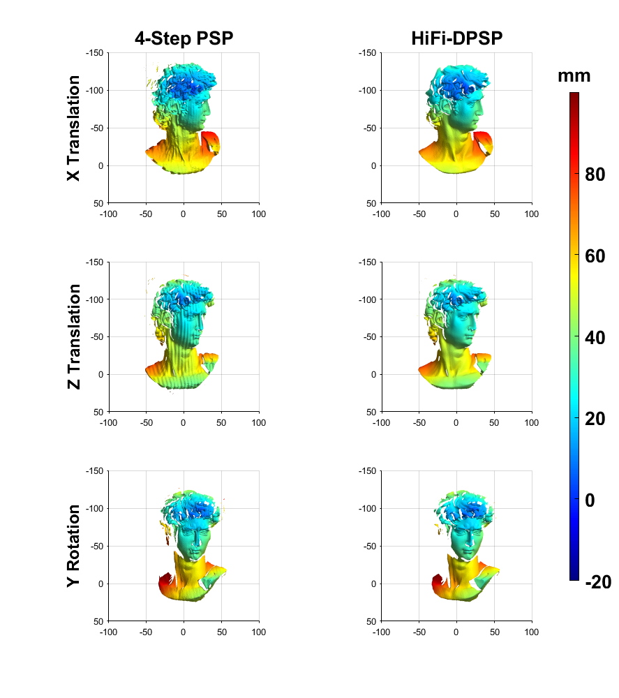

# HiFi-DPSP MATLAB Demo

This repository contains MATLAB code and example data for visualizing dynamic 3D reconstruction with High-Fidelity Dynamic Phase-Shifting Profilometry (HiFi-DPSP), and for comparing it with traditional four-step phase shifting.

## Algorithm Overview



## Folder Structure

```text
HiFi-DPSP/
|-- CalibMat/
|   |-- mCamera1Rectified.mat
|   |-- mCamera2Rectified.mat
|   `-- mProjector.mat
|-- Code/
|   |-- MainScript.m
|   |-- Func_3StepIBSC.m
|   |-- Func_Compute3DXp.m
|   |-- Func_FourStepPhaseShifting.m
|   |-- Func_GetPhaseDeviation.m
|   |-- Func_ImageAlign.m
|   |-- Func_OF3IBSC.m
|   |-- Func_POS.m
|   |-- Func_RenderTriSurface.m
|   `-- Func_UnwrapAndCompute3D.m
|-- Data/
|   |-- X-trans/
|   |-- Z-trans/
|   `-- Y-rot/
|-- FigFramework.png
`-- MainScript_preview.png
```

## File Description

- `CalibMat/`: Stores the calibrated projection matrices of the two cameras and the projector.
- `Data/X-trans/`: Example image sequence, disparity maps, and optical-flow fields for X-direction translation.
- `Data/Z-trans/`: Example image sequence, disparity maps, and optical-flow fields for Z-direction translation.
- `Data/Y-rot/`: Example image sequence, disparity maps, and optical-flow fields for Y-axis rotation.
- `Code/MainScript.m`: Main entry point. It loads the calibration/data files, performs reconstruction, and visualizes the comparison results as shaded triangular surfaces.
- `Code/Func_3StepIBSC.m`: Computes motion-error-free wrapped phase using three-step image-sequential binomial self-compensation.
- `Code/Func_Compute3DXp.m`: Triangulates 3D points from the main-camera pixel grid and matched auxiliary/projector horizontal coordinates.
- `Code/Func_FourStepPhaseShifting.m`: Computes wrapped phase using the four-step phase-shifting algorithm.
- `Code/Func_GetPhaseDeviation.m`: Estimates optical-flow-induced phase deviation from a reference projector phase map.
- `Code/Func_ImageAlign.m`: Aligns images or phase maps using optical flow and motion-region classification.
- `Code/Func_OF3IBSC.m`: Performs optical-flow-assisted three-step IBSC reconstruction.
- `Code/Func_POS.m`: Optimizes phase by fitting a sinusoidal model with phase offsets.
- `Code/Func_RenderTriSurface.m`: Converts reconstructed coordinate maps into filtered triangular surfaces and renders them with lighting.
- `Code/Func_UnwrapAndCompute3D.m`: Unwraps phase using a stereo-derived reference and computes 3D point clouds.
- `FigFramework.png`: PNG preview of the algorithm schematic used in this README.
- `MainScript_preview.png`: Example visualization result generated by `MainScript.m`.

## External Optical Flow and Stereo Matching Results

The optical-flow and disparity maps included in `Data/` are precomputed results from external algorithms. Their implementations are not included in this MATLAB demo.

- Optical flow is estimated using RAFT.
- Stereo disparity is estimated using RAFT-Stereo.
- The MATLAB code loads the resulting `.mat` files and uses them for image alignment, phase-offset estimation, phase unwrapping, and 3D reconstruction.

For each motion-condition folder, the precomputed files are:

- `mDisparity_1.mat`: disparity map computed by RAFT-Stereo from the rectified left/right camera speckle image pair for the first reconstruction group.
- `mDisparity_2.mat`: disparity map computed by RAFT-Stereo from the rectified left/right camera speckle image pair for the second reconstruction group.
- `mFlowX_1.mat`: horizontal optical-flow component computed by RAFT between the first two uniformly illuminated frames of the first pair.
- `mFlowY_1.mat`: vertical optical-flow component computed by RAFT between the first two uniformly illuminated frames of the first pair.
- `mFlowX_2.mat`: horizontal optical-flow component computed by RAFT between the first two uniformly illuminated frames of the second pair.
- `mFlowY_2.mat`: vertical optical-flow component computed by RAFT between the first two uniformly illuminated frames of the second pair.

## How to Run

1. Open MATLAB.
2. Change the current folder to `HiFi-DPSP/Code`.
3. Run:

   ```matlab
   MainScript
   ```

The script uses paths relative to its own location, so it can also be launched from another MATLAB working directory as long as the repository structure is unchanged.

## Expected Result

After running `MainScript.m`, MATLAB will display a 3-by-2 figure:

- The left column shows shaded surface reconstruction results from traditional four-step PSP.
- The right column shows shaded surface reconstruction results from HiFi-DPSP.
- The three rows correspond to `X Translation`, `Z Translation`, and `Y Rotation`.

The visualization is expected to show that HiFi-DPSP produces cleaner reconstruction under dynamic motion conditions than standard four-step phase shifting.



## References

1. Z. Teed and J. Deng, "RAFT: Recurrent All-Pairs Field Transforms for Optical Flow," European Conference on Computer Vision (ECCV), 2020. [Paper](https://arxiv.org/abs/2003.12039)
2. L. Lipson, Z. Teed, and J. Deng, "RAFT-Stereo: Multilevel Recurrent Field Transforms for Stereo Matching," International Conference on 3D Vision (3DV), 2021. [Paper](https://arxiv.org/abs/2109.07547)
